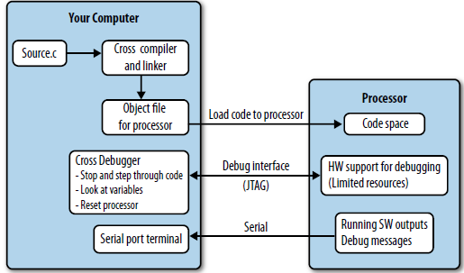

# 🌱 Making Embedded Systems - Elecia Whites - Chapter 1

## Debugging
Unlike software running in computer.
Embedded system requires cross compiler, cross debugger. 
Debugger sits on your computer and communicates with the target processor through the special processor interface.

Image show below


The interface is dedicated to letting someone else eavesdrop on the processor as it works, AKA JTAG

Processor must expend some of its resources to support the debug interface, allowing the debugger to halt it as it runs and providing the normal sorts of debug information

To avoid buying an emulator or dealing with the processor limitations, many embedded systems are designed to have their debugging primarily done via ```printf``` or some sort of lighter weight logging to an otherwise unused communication port

Writing software for an embedded system can be tricky, as you have to balance the needs of the system and the constraints of the hardware. Now you'll need to add another item to your to-do list: making the software debuggable in a somewhat hostile environment.

## More Challenges
Find & Plot the diagram before jumping into it
1. Memory (RAM)
2. Code space (ROM)
3. Processor cycles or speed
4. Battery life (or power savings)
5. Processor peripherals